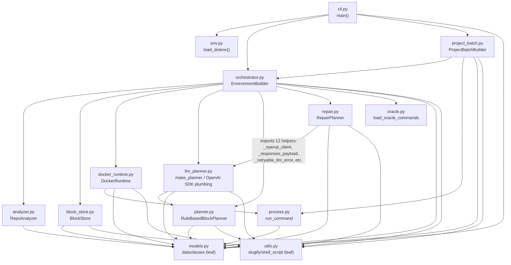
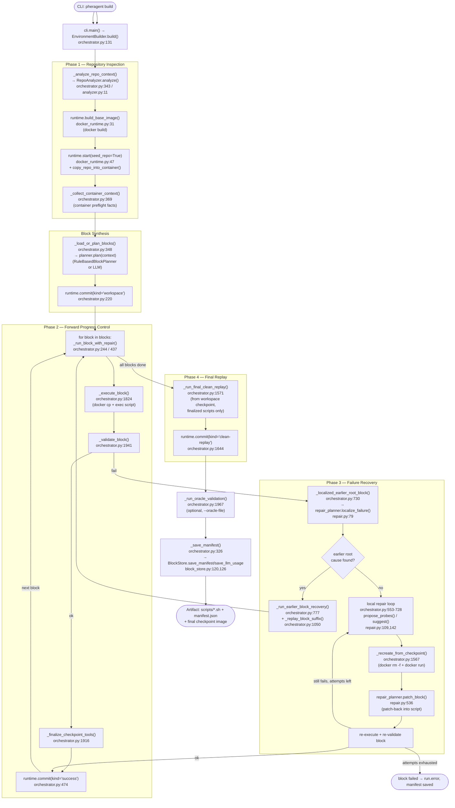

# HerAgent (`pheragent`) Architecture

This document maps the paper's conceptual model of HerAgent onto the actual
`pheragent` source tree, as of the `mosip-baselines` branch (identical to
`main` at the time of writing — `git diff main --stat` is empty).

All citations are `path/to/file.py:line`. Claims not directly backed by a
citation are marked "inferred."

## 1. Repo Map

```text
pheragent/
├── pyproject.toml          # deps: openai>=2.0, pydantic==2.12.0; py>=3.14; hatchling build
├── README.md                # primary usage doc (most current/authoritative)
├── docs/                    # dev-process notes, NOT user docs
│   ├── ablation-development-plan.md
│   ├── agent-loop-optimization.md
│   └── setupbench-failure-triage.md
├── src/pheragent/           # the entire agent, 15 files, ~9000 lines
│   ├── __init__.py          # public API re-exports
│   ├── __main__.py           # `python -m pheragent`
│   ├── cli.py                # argparse CLI: plan / build / build-projects
│   ├── env.py                 # .env loader
│   ├── models.py              # dataclasses: Block/Checkpoint/Request/Result equivalents
│   ├── analyzer.py            # Phase 1 (static half): RepoAnalyzer
│   ├── docker_runtime.py      # Docker CLI wrapper: build/run/exec/commit
│   ├── planner.py             # deterministic (rule-based) block planner
│   ├── llm_planner.py         # LLM block planner + OpenAI SDK plumbing (shared by repair.py)
│   ├── repair.py              # Phase 3: LLM/heuristic repair, localization, patch-back
│   ├── orchestrator.py        # Phase 2+3+4: EnvironmentBuilder, the control loop
│   ├── block_store.py         # persists blocks/scripts/logs/manifest to disk
│   ├── oracle.py              # loads + sanitizes external oracle/CI validation commands
│   ├── project_batch.py       # multi-repo *batch* driver (clone + build N independent repos)
│   ├── process.py             # subprocess wrapper (streaming + non-streaming)
│   └── utils.py               # slugify, shell_script wrapper, tail_text, run-id
├── scripts/                  # benchmark wrappers around `pheragent build-projects`
│   ├── run_setupbench.py
│   ├── run_executionagent.py
│   ├── run_repo2run.py
│   ├── enrich_block_validation_ci_matches.py
│   └── summarize_executionagent_validation.py
├── tests/                    # pytest suite, one file per src module + fixtures
│   ├── dockerfile/Dockerfile.heragent-thin   # the base image used in tests/experiments
│   └── projects/*.txt        # `owner/repo commit` batch input files (SetupBench/Repo2Run/ExecutionAgent)
└── uv.lock
```

**HerAgent vs. leftover EnvAgent vs. scaffolding**: there is no EnvAgent code
in this tree at all — no separate Testsuite/Env-build/Env-repair agent
classes. Every source file under `src/pheragent/` is part of the current
HerAgent implementation. The only "scaffolding" layer is `scripts/` +
`tests/projects/*.txt`, which are benchmark harnesses (SetupBench,
ExecutionAgent, Repo2Run) built on top of the public CLI, not part of the
agent itself.

**Branch note**: `README.md:311-380` documents three other branches —
`repo2run` (Repo2Run-specific repair/validation changes), `single-ablation`
(extra ablation modes: `single-command-forward-recovery`,
`single-command-rollback-regenerate`, `block-rollback-regenerate`,
`block-live-repair-no-patch`), and an `ablation` alias. This document
describes `main`/`mosip-baselines` only; the other branches were not read.

## 2. Entry Points

- **CLI**: `pheragent = "pheragent.cli:main"` (`pyproject.toml:13`) →
  `cli.py:13` `main()`. Also runnable as `python -m pheragent`
  (`__main__.py`).
- Three subcommands, all built by `_build_parser()` (`cli.py:50`):
  - `pheragent plan --repo <path>` → `EnvironmentBuilder(request).plan_only()`
    (`cli.py:18-22`). No Docker; just analysis + block script generation.
  - `pheragent build --repo <path> --base-dockerfile <path>` →
    `EnvironmentBuilder(request).build()` (`cli.py:24-28`). The full
    checkpointed run.
  - `pheragent build-projects --projects-file <path> --base-dockerfile <path>`
    → `ProjectBatchBuilder(...).build_all()` (`cli.py:30-44`). Clones and
    builds N independent repos from a flat `owner/repo commit` file.
- **Programmatic API**: `pheragent/__init__.py:3-11` re-exports
  `BuildRequest`, `BuildResult`, `CommandBlock`, `EnvironmentBuilder`,
  `RepoContext` — the same objects the CLI uses.
- `.env` is auto-loaded from CWD before argument parsing
  (`cli.py:14`, `env.py:7`), non-destructively (`env.py:21-22`).

## 3. Phase → Code Mapping

The paper's four phases are **not** four separate classes; they are stages
inside one method, `EnvironmentBuilder.build()` (`orchestrator.py:131-324`),
which calls out to the analyzer, planner, docker runtime, and repair planner.

### Phase 1 — Repository Inspection

Split across two mechanisms, one static (pre-container) and one dynamic
(inside the container) — the paper describes this as one phase, the code
implements it as two:

- **Static analysis** (no Docker): `RepoAnalyzer.analyze()`
  (`analyzer.py:11-25`) walks the repo on disk with `Path.exists()` / `find`
  equivalents for known manifest files (`pyproject.toml`, `package.json`,
  `go.mod`, `Cargo.toml`, `pom.xml`/`build.gradle*`) — **not** a general
  `ls`/`grep` exploration loop; it is a fixed set of `_detect_python`,
  `_detect_node`, `_detect_go`, `_detect_rust`, `_detect_java` methods
  (`analyzer.py:37-131`). Produces `RepoContext` (`models.py:156-165`):
  `package_files`, `languages`, `package_managers`, `test_commands`,
  `build_commands`, `notes`.
- **Dynamic/container preflight**: after the base image is built and the
  container started, `_collect_container_context()`
  (`orchestrator.py:369-392`) runs `_CONTAINER_PREFLIGHT_COMMAND`
  (`orchestrator.py:2333-2387`) inside the container — `uname`, `/etc/os-release`,
  a fixed tool-version probe list (`sh bash python python3 pip pip3 uv gcc g++
  make cmake ninja bazel node npm java go rustc cargo nvidia-smi nvcc apt-get
  yum apk`), a Python introspection heredoc, and a `find`-based repo-marker
  scan (a *different*, smaller marker list than the analyzer's:
  `pyproject.toml, setup.py, setup.cfg, requirements*.txt, uv.lock, WORKSPACE(.bazel),
  MODULE.bazel, .bazelrc, package.json, go.mod, Cargo.toml` —
  `orchestrator.py:2371-2384`). Output becomes `RepoContext.runtime_notes`
  (`_runtime_notes_from_preflight`, `orchestrator.py:2390-2405`), which is
  fed into both LLM planning and LLM repair prompts.
- Cloning (for `build-projects`) is handled separately in `project_batch.py`
  (see §7), not by the analyzer.

### Phase 2 — Forward Progress Control

- **Control loop**: `EnvironmentBuilder.build()` (`orchestrator.py:131-324`).
  After base image build + repo copy + preflight + block planning, it commits
  a `kind="workspace"` checkpoint (`orchestrator.py:220-227`), then iterates
  blocks (`orchestrator.py:244-269`) calling `_run_block_with_repair()` per
  block (block-granularity forward is the default; `single-command-forward`
  and `whole-script-forward` ablations change this — see §8).
- **Block synthesis** ("plan blocks"): `_load_or_plan_blocks()`
  (`orchestrator.py:348-367`) → `self.planner.plan(context)`, where
  `self.planner` is either `RuleBasedBlockPlanner` (`planner.py:15-76`) or
  `OpenAIResponsesBlockPlanner` (`llm_planner.py:36-199`), selected by
  `make_planner()` (`llm_planner.py:202-238`) based on `--planner`
  (`auto`/`rules`/`llm`) and whether an API key env var is set.
- **Execution unit**: `_execute_block()` (`orchestrator.py:1824-1856`) copies
  the block's `.sh` script into the container (`docker cp`) and runs it via
  `DockerRuntime.execute_script()` (`docker_runtime.py:100-112`).
- **Validation**: `_validate_block()` (`orchestrator.py:1941-1965`) runs
  `block.validation_command` if set.
- **Per-block checkpoint**: on success, `_finalize_checkpoint_tools()`
  (`orchestrator.py:1916-1939`, exports `uv` into `/usr/local/bin` so later
  blocks/replays see it) then `runtime.commit(kind="success")`
  (`orchestrator.py:474-479`).

### Phase 3 — Failure Recovery

Two distinct mechanisms inside `_run_block_with_repair()`
(`orchestrator.py:437-728`):

- **Bounded local repair** (paper: "attempt → patch-back → replay"): the
  `for repair_attempt in range(1, max_repair_attempts + 1)` loop
  (`orchestrator.py:553-728`). Per attempt: optionally
  `repair_planner.propose_probes()` (read-only diagnostic commands,
  `orchestrator.py:560-608`), then `repair_planner.suggest()`
  (`orchestrator.py:616-627`) → `RepairCommand(title, command, patch_script,
  patch_validation_command)` (`repair.py:32-38`). `command` is executed live
  first (`orchestrator.py:663-666`); only on success is it **patched back**
  into the block script via `repair_planner.patch_block()`
  (`repair.py:536-563`, prepends `patch_script` to `block.script`,
  guarded by `progress_control.patch_back`) and the block replayed from its
  checkpoint baseline (`orchestrator.py:685-687`, gated by
  `progress_control.checkpoint_rollback` via `_recreate_from_checkpoint()`,
  `orchestrator.py:1567-1569`).
- **Failure relocation / rollback** (paper: "if root cause is an earlier
  block, roll back to an earlier checkpoint"): `_localized_earlier_root_block()`
  (`orchestrator.py:730-775`) calls `repair_planner.localize_failure()`
  (`repair.py:79-107`, LLM call using `_LOCALIZATION_SYSTEM_PROMPT`,
  `repair.py:1718-1755`, with a heuristic fallback
  `_heuristic_failure_localization`, `repair.py:721-785`, that pattern-matches
  failure output against earlier block id/title/goal tokens for
  python/node/go/rust/java/native-build). If an earlier block is implicated,
  `_run_earlier_block_recovery()` (`orchestrator.py:777-974`) invalidates the
  checkpoint for every block from the root cause through the failed block
  (`orchestrator.py:799-808`), repairs the root block from *its* baseline,
  then `_replay_block_suffix()` (`orchestrator.py:1050-1106`) re-executes the
  invalidated blocks in order. If the suffix replay itself fails on a
  different block, `_repair_replayed_suffix_failure()`
  (`orchestrator.py:976-1049`) recurses into ordinary block-level repair for
  that block instead of re-blaming the root cause.
- Both mechanisms are gated by `ProgressControl.local_repair` /
  `.checkpoint_rollback` (`models.py:24-30`), which the `--ablation` flag
  controls (`progress_control_for_ablation`, `models.py:33-71`).

### Phase 4 — Final Replay

- `_run_final_clean_replay()` (`orchestrator.py:1571-1653`, or
  `_run_whole_script_clean_replay()` for whole-script modes,
  `orchestrator.py:1655-1728`): recreates the container **from the original
  workspace checkpoint** (`runtime.recreate_from(workspace_image)`,
  `orchestrator.py:1581`) — i.e., before *any* block or repair ran — then
  replays the **finalized** block scripts (with any repair patches already
  baked in) end-to-end. Only if this clean replay's script execution +
  validation + `uv` export all succeed does it commit a
  `kind="clean-replay"` checkpoint (`orchestrator.py:1644-1653`) and only
  then is `result.ok = True` reachable in `build()`
  (`orchestrator.py:271-316`).
- Gated by `ProgressControl.final_clean_replay`, **true by default**
  (`DEFAULT_ABLATION_MODE = "full"`, `models.py:20`, and
  `progress_control_for_ablation("full")` sets `final_clean_replay=True`,
  `models.py:34-35`). ⚠️ **Doc/code drift**: `docs/ablation-development-plan.md:48-52`
  says "The current default remains: `without-final-clean-replay`" — this is
  stale; the code's actual default is `full` (clean replay **on**).
- If `--oracle-file` is given, `_run_oracle_validation()`
  (`orchestrator.py:1967-1996`) runs afterward, against the *final* image —
  this is extra/optional validation beyond what the paper's four phases
  describe, used by the SetupBench/Repo2Run/ExecutionAgent benchmarks.

## 4. Data Structures

### Block: `CommandBlock` (`models.py:168-180`)

```python
@dataclass(slots=True)
class CommandBlock:
    id: str
    title: str
    goal: str
    script: str
    order: int = 0
    validation_command: str | None = None
    status: BlockStatus = "planned"           # planned/running/succeeded/failed/repaired/skipped
    last_error: str | None = None
    baseline_checkpoint: str | None = None
    success_checkpoint: str | None = None
    repair_attempts: int = 0
```

Mapping to the paper's `⟨Hash, Name, Purpose, Prelude, BashScript, V⟩`:

| Paper field | Code field | Notes |
| --- | --- | --- |
| Hash | `id` | Not a content hash — a slug like `20-python-runtime` (`planner.py:79-80`, `llm_planner.py:138-139`). No integrity/content hash of the block exists anywhere. |
| Name | `title` | direct |
| Purpose | `goal` | direct |
| Prelude | *(none — merged into `script`)* | The "persistent shell context" is injected as a text preamble via `_ensure_inherited_block_prelude()` / `_prepend_inherited_prelude()` (`orchestrator.py:2104-2164`), delimited by `# [pheragent] inherited environment prelude begin/end` sentinels, and physically prepended to `block.script`. It is **not** a separate structured field — you cannot inspect "the prelude" independent of the script text. |
| BashScript | `script` | POSIX `sh`, not bash (`utils.shell_script`, `utils.py:23-27`, forces `#!/bin/sh`). |
| V (validation targets, plural) | `validation_command` | **Singular** string, not a set. Multiple checks are joined into one string with `&&` by `_join_validation()` (`planner.py:244-245`) for multi-language blocks. |

`CommandBlock` also carries **mutable execution state** the paper keeps
separate from the static block artifact: `status`, `last_error`,
`baseline_checkpoint`, `success_checkpoint`, `repair_attempts`. Code
conflates "block-as-plan" and "block-as-execution-record" into one dataclass
that is repeatedly mutated and rewritten to disk (`BlockStore.update_block()`,
`block_store.py:56-57`) as the run progresses.

### Checkpoint: `Checkpoint` (`models.py:203-209`)

```python
@dataclass(slots=True)
class Checkpoint:
    id: str
    image_ref: str
    block_id: str | None
    parent_image_ref: str | None
    kind: str        # "workspace" | "success" | "repaired" | "resume" | "clean-replay"
```

Mapping to the paper's `Ckpt_i = ⟨B_i, D_i, R_i⟩`:

| Paper field | Code field | Notes |
| --- | --- | --- |
| B_i (the block) | `block_id` | a string reference, not the embedded `CommandBlock` object |
| D_i (Docker state) | `image_ref` | the `docker commit` image tag |
| R_i (exit codes + logs) | *(not on `Checkpoint` at all)* | Lives in a **separate, parallel** list of `BlockExecution` records (`models.py:212-226`: `block_id, phase, attempt, exit_code, timed_out, stdout_tail, stderr_tail, checkpoint_before, checkpoint_after, repair_command, duration_s, command, log_path`), persisted to `executions.jsonl` (`block_store.py:72-74`) and per-attempt log files under `logs/<block_id>/` (`block_store.py:76-118`). The paper's single tuple is split across two independently-appended structures (`checkpoints: list[Checkpoint]` and `executions: list[BlockExecution]` in `orchestrator.py:135-136`), joined only loosely by matching `block_id` / `checkpoint_before` strings — there is no object reference tying a specific `Checkpoint` to the specific `BlockExecution` record(s) that produced it. |

### Seven block-template categories

These are **not enumerated as a named list or enum anywhere in the code** —
they emerge as the branch structure of `RuleBasedBlockPlanner.plan()`
(`planner.py:23-76`) and are separately described in prose in the LLM
system prompt (`llm_planner.py:1084-1133`). The two descriptions are
consistent but not identical:

**Rule-based planner's implicit seven** (`planner.py`):
1. System packages — `_system_packages_block()` (`planner.py:141-149`)
2. Language runtime — `_runtime_block()` (`planner.py:87-95`)
3. Project dependencies — `_dependency_block()` (`planner.py:98-106`)
4. Additional/merged runtime — `_combined_runtime_block()` (`planner.py:109-119`, used when >2 languages)
5. Additional/merged dependencies — `_combined_dependency_block()` (`planner.py:122-138`)
6. Native build config — `_native_build_config_block()` (`planner.py:152-163`, only when go/rust/java present, `_needs_native_build_config`, `planner.py:248-250`)
7. Test tooling — `_test_tooling_block()` (`planner.py:166-174`)

**LLM planner's prompt template** (`llm_planner.py:1114-1121`): `00-preflight,
10-system-packages, 20-runtime-toolchain, 30-project-dependencies, optional
40-native-build-config, 50-test-tooling, optional
60-service-or-final-validation-prep` — 7 named slots, but the LLM's slot #1
is an explicit *preflight* block (not present as a distinct category in the
rule-based enumeration above, though `RuleBasedBlockPlanner` also always
emits `00-preflight`, `planner.py:25-33`), and slot #7 is a
"service-or-final-validation-prep" category with no rule-based equivalent.

## 5. Docker / Checkpoint Layer

All of it lives in `DockerRuntime` (`docker_runtime.py:19-421`), a thin
wrapper around the `docker` CLI via `subprocess` (through `process.run_command`,
`process.py:13-65`) — there is no Docker SDK/API client.

- **Base image**: `build_base_image()` (`docker_runtime.py:31-45`) → `docker
  build -f <base_dockerfile> -t <base_image> <repo_path>`. `base_image` name:
  `f"{slugify(image_prefix)}:{run_id}-{hash}-base"` (`docker_runtime.py:23-24`).
- **Container start**: `start()` (`docker_runtime.py:47-70`) → `docker run -d
  --entrypoint sh <image> -lc "trap : TERM INT; sleep infinity & wait"` — a
  long-lived idle container, not a fresh container per command. Repo files are
  seeded via `copy_repo_into_container()` (`docker_runtime.py:72-98`, `docker
  cp <repo_path>/. <container>:<workdir>` after `rm -rf && mkdir -p` the
  workdir).
- **Block execution**: `execute_script()` (`docker_runtime.py:100-112`, `docker
  cp` the script into `/tmp/pheragent/blocks/`, then `docker exec ... sh
  <path>`), or `execute_command()` (`docker_runtime.py:114-128`, `docker exec
  --workdir <workdir> ... sh -lc "<command>"`). A third mode,
  `execute_command_sequence()` (`docker_runtime.py:130-357`), drives one
  persistent `docker exec -i ... sh` process with a sentinel-based per-command
  exit-code protocol — used only by the `single-command-forward` ablation.
- **Checkpointing**: `commit()` (`docker_runtime.py:359-387`) → `docker commit
  <container> <image_ref>`. Image tag format:
  `f"{prefix}:{run_id}-{hash}-{counter:03d}-{slugify(block_id)}-{slugify(kind)}"`
  (`docker_runtime.py:369-373`) — e.g.
  `pheragent:abc123-d4e5f6-003-30-python-deps-success`. This is exactly the
  tag format `README.md:127-135` says resume mode parses (`<block-id>-success`
  / `<block-id>-repaired` suffix) via
  `_infer_completed_block_index()` (`orchestrator.py:423-435`).
- **Restore**: `recreate_from()` (`docker_runtime.py:389-391`) = `remove_current_container()`
  (`docker rm -f`) + `start(image_ref)`. Used for rollback-before-repair
  (`_recreate_from_checkpoint`, `orchestrator.py:1567-1569`) and for the
  final clean replay (`orchestrator.py:1581`).
- **Naming/storage**: checkpoints are plain Docker images tagged in the local
  Docker image store — there is no separate checkpoint database or manifest
  of images beyond `Checkpoint` objects appended to `checkpoints: list[Checkpoint]`
  in memory and serialized into `manifest.json` (`block_store.py:120-124`).
  `DockerRuntime._created_images` (`docker_runtime.py:29`) tracks every image
  created in the run.
- **Pruning**: only at the very end via `cleanup()` (`docker_runtime.py:407-412`),
  gated by `--cleanup-images` (off by default) — `docker rmi -f` every
  created image in reverse order. There is **no incremental pruning**; a long
  run with many blocks/repairs accumulates one image per checkpoint until
  cleanup. Container removal (not images) happens by default unless
  `--keep-container`.

## 6. LLM Layer

- **Client**: OpenAI Python SDK (`openai>=2.0`, `pyproject.toml:8`), lazily
  imported in `_openai_client()` (`llm_planner.py:241-252`),
  `OpenAI(api_key=..., base_url=..., timeout=..., max_retries=0)` — pheragent
  does its own retry loop (`max_retries=0` disables SDK-level retries).
- **Two API surfaces**, selected by `--llm-api {responses,chat-completions}`:
  `_responses_payload()` (`llm_planner.py:288-296`, uses
  `client.responses.create(..., stream=True)`) or
  `_chat_completion_payload()` (`llm_planner.py:298-306`,
  `client.chat.completions.create(...)`). Both request strict JSON output
  (`"text":{"format":{"type":"json_object"}}` or
  `"response_format":{"type":"json_object"}`).
- **Model/temperature/retry config**: `OpenAIResponsesPlannerConfig`
  (`llm_planner.py:22-33`) and `OpenAIResponsesRepairConfig`
  (`repair.py:52-62`). Default model **`"gpt-5.5"`**
  (`llm_planner.py:24`, `repair.py:54`, overridable by `--model` /
  `PHERAGENT_MODEL` / `OPENAI_MODEL` env vars, `llm_planner.py:226`,
  `repair.py:848-853`). **No `temperature` parameter is set or sent
  anywhere** in either payload builder — this contradicts the paper's
  claim of "temperature 0.7." Retries: `--llm-retries` (default 3,
  `cli.py:140`), exponential backoff `_sleep_before_retry()`
  (`llm_planner.py:534-537`, `delay * 2**(attempt-1)`), retried only for
  `_retryable_llm_error()` cases (429/5xx/timeout/connection errors,
  `llm_planner.py:540-550`). ⚠️ The dev docs use different models in
  practice: `docs/ablation-development-plan.md` and
  `docs/setupbench-failure-triage.md` both use `gpt-5.4-20260305`; the
  `repo2run` branch commands in `README.md:232-244` use
  `gpt-4o-20241120` — none of these match the `gpt-5.5` code default.
- **Prompt templates** (all inline Python string constants, not files):
  - Block planning: `_SYSTEM_PROMPT` (`llm_planner.py:1084-1133`).
  - Failure localization: `_LOCALIZATION_SYSTEM_PROMPT` (`repair.py:1718-1755`).
  - Repair suggestion: `_REPAIR_SYSTEM_PROMPT` (`repair.py:1758-1837`).
  - Read-only diagnostic probes: `_PROBE_SYSTEM_PROMPT` (`repair.py:1840-1866`).
- **Token usage accounting**: every call updates a per-phase counter
  (`planner`, `localization`, `probe`, `repair`) via `_add_token_usage()`
  (`llm_planner.py:425-427`), merged by `merge_usage_summaries()`
  (`llm_planner.py:430-441`) and written to `llm-usage.json` per run
  (`block_store.py:126-130`) and `llm-usage-projects.jsonl` per batch
  (`project_batch.py:787-823`).
- **Fallback**: `--planner auto` (default) uses the LLM only if an API key
  env var is set (`make_planner`, `llm_planner.py:218-219`); on any LLM
  exception it falls back to `RuleBasedBlockPlanner` only when
  `fallback_on_error=True`, which is set precisely when mode is `auto`
  (`llm_planner.py:235`) — i.e. `--planner llm` explicitly does **not**
  fall back on error, it raises.
- **Guardrails / sanitization**: LLM-authored blocks are aggressively
  post-processed, not trusted verbatim. `_parse_blocks()`
  (`llm_planner.py:126-199`) detects "this looks like a python-runtime /
  python-deps / node-runtime / go-deps / build-test-prep block" by regex over
  id/title/script (`_is_python_runtime_block` etc., `llm_planner.py:615-807`)
  and **replaces** the LLM's script with a known-safe hand-written script
  (e.g. `_safe_python_dependency_script()`, `llm_planner.py:840-1008`) for
  those categories. It also outright rejects blocks that look like they
  modify repo source (`_repo_code_modification_rejection_reason()`,
  `llm_planner.py:790-806`, checks for `conftest.py`, `open(`, `sed -i`,
  writes to `.py`/`.js`/etc.). Repair commands go through a parallel but
  distinct set of rejection filters (`_repair_command_rejection_reason()`,
  `repair.py:1422-1467`, and the stricter `_probe_command_rejection_reason()`
  for read-only probes, `repair.py:1378-1419`) blocking `docker `, `git push`,
  `mkfs`, unsafe `rm -rf` targets, non-durable heredocs, etc.

## 7. Validation Execution

There are actually **three separate validation mechanisms**, at different
layers:

1. **Block validation** (`_validate_block`, `orchestrator.py:1941-1965`):
   runs `block.validation_command` as one `docker exec` command; pass/fail
   = `CommandResult.ok` (`exit_code == 0 and not timed_out`,
   `models.py:192-194`). This is what gates checkpointing/repair within
   Phase 2/3.
2. **Clean-replay validation**: the same `block.validation_command`, re-run
   during `_run_final_clean_replay()` (`orchestrator.py:1611-1626`) against
   the freshly replayed state, before the final checkpoint is committed.
3. **Oracle validation** (`_run_oracle_validation`, `orchestrator.py:1967-1996`):
   optional, external, only when `--oracle-file` is given. Commands come from
   a JSON file (`load_oracle_commands`, `oracle.py:8-21`, reads
   `fixed_test_commands[].commands`), then heavily rewritten by
   `_sanitize_oracle_command()` (`oracle.py:29-49`) — e.g. replacing raw
   `npm run start && curl ...` patterns with a safe `setsid`-isolated,
   polling-with-timeout web-server check (`_safe_web_server_oracle`,
   `oracle.py:86-129`), or normalizing "run the whole pytest/tox suite" into
   "collect/showconfig only" (`_downgrade_full_suite_setupbench_oracle`,
   `oracle.py:52-66`) — because oracle files are external/untrusted CI-derived
   commands, not agent-authored ones.

**Notable gap**: the rule-based Java `validation_command`s
(`_runtime_validation_command`, `_dependency_validation_command`,
`_test_tooling_validation_command` in `planner.py:214-215, 229, 649-651`) all
end their command chain in `|| true`, meaning `CommandResult.ok` is
unconditionally `True` for Java blocks regardless of whether `java`/`mvn`/
`gradle` actually succeeded. This is unique to the Java branch — the
Python/Node/Go/Rust validation commands do not swallow failures this way.

## 8. Ablation Modes (how `ProgressControl` maps phases on/off)

`ProgressControl` (`models.py:23-30`) is the single struct that turns the
four phases' sub-behaviors on/off; `progress_control_for_ablation()`
(`models.py:33-71`) is the only place ablation-mode strings are translated
into it. Relevant to understanding *which* code path a given `--ablation`
flag exercises: `forward_granularity` picks between
`_run_block_with_repair`'s block loop, `_execute_block_commands` (command
granularity), or `_run_whole_script_forward`; `recovery_granularity` picks
between the local-repair loop, `_run_block_command_recovery`, or
`_run_whole_script_recovery`.

---

## Diagram 1 — Module Dependency Graph



Note the `repair.py → llm_planner.py` edge: `repair.py:11-27` imports
twelve private (`_`-prefixed) helpers directly from `llm_planner.py`
(`_add_token_usage`, `_chat_completion_payload`, `_openai_client`,
`_responses_payload`, `_retryable_llm_error`, `_sleep_before_retry`,
`merge_usage_summaries`, etc.) rather than a shared internal module — the two
files are tightly coupled and effectively share one OpenAI-transport
implementation.

## Diagram 2 — Runtime Phase Flow for One `pheragent build` Run


